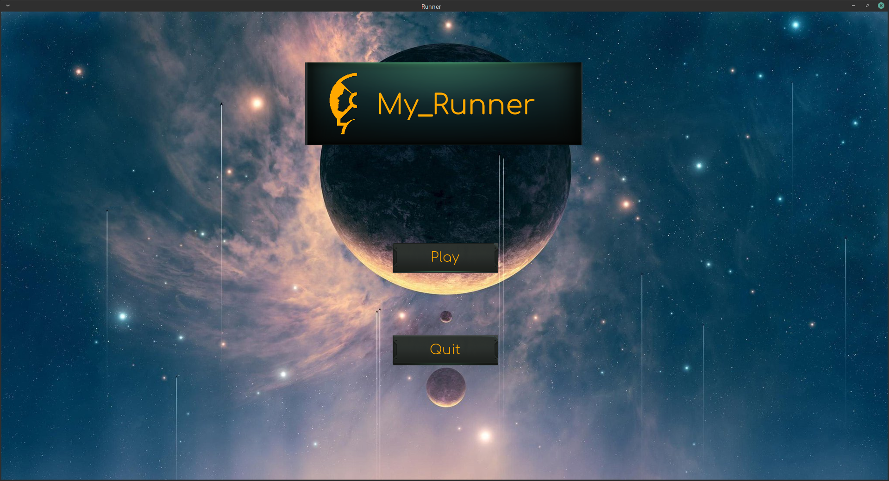
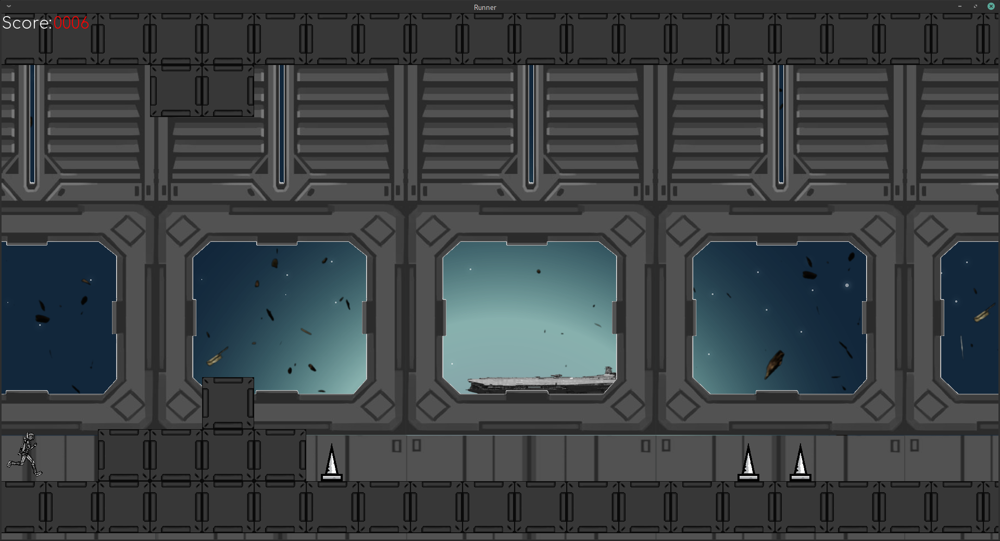
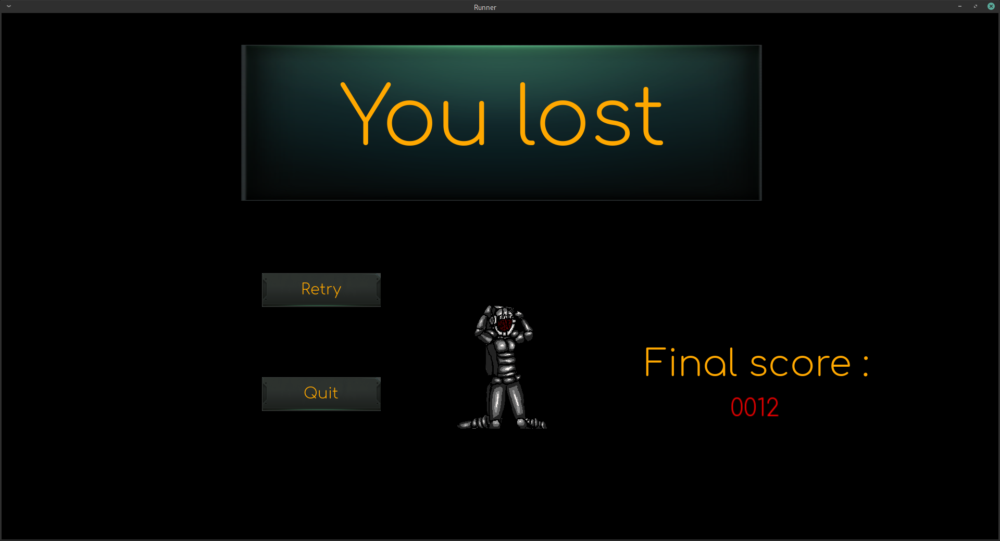
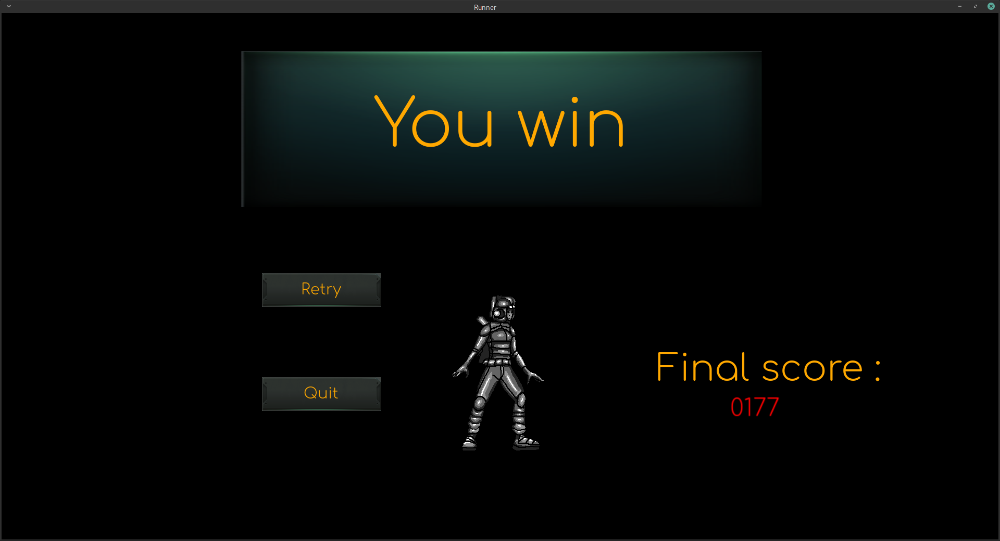

# My_Runner

## Project Description
Epitech 1st year Project where the goal was to make a game where you control a character running and you have to avoid enemies or traps.
The game is made in **C** and with the **CSFML** library

## Project Screenshots
Here are some of the ingame screenshots.

## Compilation
To be able to compile, you must install the **CSFML** library.
Then, you have to run the **`make`** command.
To uninstall the game, run **`make fclean`**.

## Run the game
### Map
To run the game you have to use a **map**.
A **map** is a text file with information where objects must be placed when the game is loading it.
Here is an example of a **map**:

    0000000000000000000000000000

           00
          00011           3
    0000000000000000000000000000

Here is the description of the numbers:
- **0** -> **Block**, the player can run on it but dies if he touches it on the sides or from the bottom.
- **1** -> **Spike**, the player dies if he touches it.
- **3** -> **End point**, if the player touches it, he win the game.

### Play the game
After creating your map, you can run the game using you newly created map with this command: `./my_runner [your_map.txt]`
